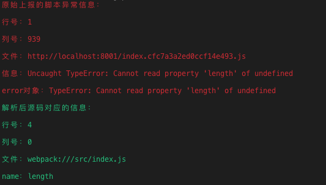

# 一个旨在讲清楚如何在不暴露源码的情况下定位前端脚本错误的最小版前端监控系统
<p align="center">

</p>
## 使用

模拟部署
```bash
cd client
npm run deploy
```

打开服务器
```bash
cd server
node app
```

打开 CDN 服务器

```bash
cd cdn-server
node app
```

打开监控系统
```bash
cd monitor-server
node app
```

浏览器打开页面 [http://localhost:8000](http://localhost:8000)

